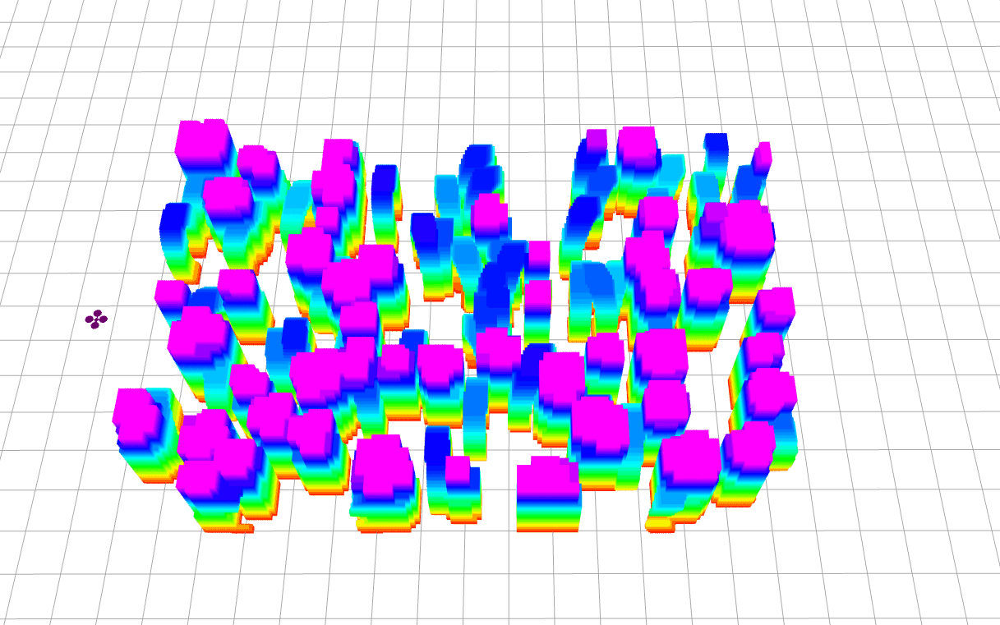

### Hi there 👋

<!--
**edmundwsy/edmundwsy** is a ✨ _special_ ✨ repository because its `README.md` (this file) appears on your GitHub profile.

Here are some ideas to get you started:

- 🔭 I’m currently s on ...
- 🌱 I’m currently learning ...
- 👯 I’m looking to collaborate on ...
- 🤔 I’m looking for help with ...
- 💬 Ask me about ...
- 📫 How to reach me: ...
- 😄 Pronouns: ...
- ⚡ Fun fact: ...
-->
- ✨ Let's explore something interesting together~
- 🖋️ I obtained my Bachelor's degree in Automation (Qian Xuesen's class, with honor) in 2021 from 🏫️[Xi'an Jiaotong University](http://en.xjtu.edu.cn/), China. In 2020 I was a visiting student in 🏫️University of Edinburgh.
I started my MSc Robotics study at 🏫️[Technische Universiteit Delft (MSc Robotics)](https://www.tudelft.nl/onderwijs/opleidingen/masters/rb/msc-robotics/) in September, 2021.
- 🌱 As a new learner to robotics, I am interested in **MAVs**, **motion planning**, **MPC** and **reinforcement learning**.
- 🔭 Previously I worked in **motion planning**, **event-based vision** as my bachelor thesis, supervised by Dr. Fei Gao, at [ZJU-FAST](http://www.zju-fast.com/) lab, 🏫️Zhejiang University. *We are sincerely doing really cool things to push the boundary of quadrotors here!*
- 🤔 I’m looking for PhD positions in robotics（especially in robot planning). If you are interested in my background and have some available positions, please let me know!!! 😄️
- 💬 I'm open to any discussions. If you have any question about robotics, please feel free to contact me. 

### Highlights

Here are some robotics projects I'd like to show you!

| [Fast-Dynamic-Vision](https://github.com/ZJU-FAST-Lab/FAST-Dynamic-Vision) | [k-PRM planner](https://github.com/edmundwsy/RO47005-PDM-Final) |
|---|---|
 |  |

---

<!-- 

 -->
 
 
<a href="mailto:edmundwsy@outlook.com" target="_blank">
<a href="mailto:siyuanwu99@gmail.com" target="_blank">
<a href="https://www.linkedin.com/in/siyuanwu99/" target="_blank">
<a href="https://www.zhihu.com/people/eee-28-90" target="_blank">
  
